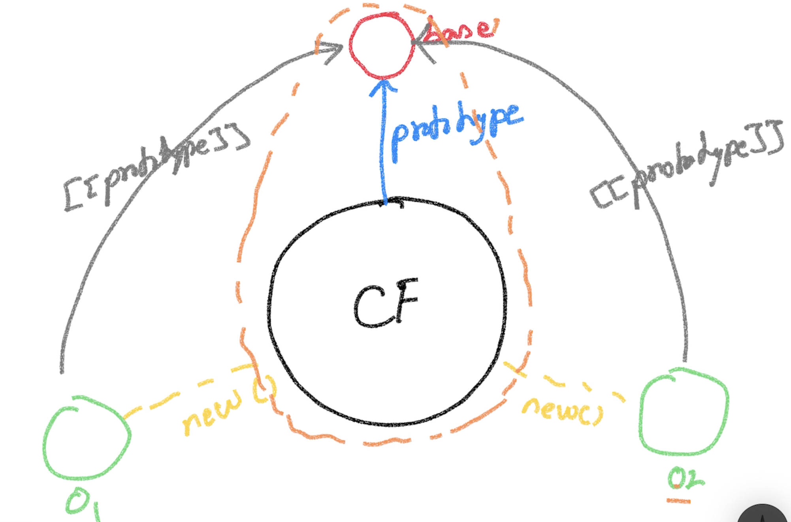

# JavaScript (ES5) #


## Language Features ##
### Data Types ###
1. number
2. boolean
3. string
4. object
5. undefined
6. function
### Programming Constructs ###
1. var
2. if else
3. switch case
4. while
5. for
6. try catch finally
7. throw
8. function
9. typeof
### APIs ###
1. Math
2. Array
3. Regex
4. Error
5. Timer (setTimeout, clearTimeout, setInterval, clearInterval)
6. XMLHttpRequest


## Language Categories ##
1. Line Oriented (GW Basic, Fortran)
2. Procedural (COBOL, C)
3. Object Based (Visual Basic, Delphi, **JavaScript**)
4. Object Oriented (C++, Java, C#)
5. Functional (Haskell, LISP, F#, Scala, **JavaScript**)
---
1. loosely typed (**JavaScript**, Python)
2. strongly typed
---
1. static 
2. dynamic (**JavaScript**)
```
var obj = {}

//add attributes after the object is created
obj.id = 100
obj.name = 'Pen'

//remove attributes from an object
delete obj.id
```

### Functional Language ###
- Functions are first class citizens (like data (specifically 'object'))

- Creation (1)
```
//function statement
function fn(){
}

//function expression
var x = function(){
}
```

- Creation (2)
```
var fn = new Function()

typeof fn

var f1 = new Function("console.log('f1 invoked')")

var add = new Function("x", "y", "return x + y;")

add(100,200)
```

- Attributes
```
function fn(){
}

fn.id = 100
```

- Methods
```
function fn(){
}
fn.print = function(){
    console.log('Hi there!')
}
```

- Can be passed as arguments to other functions
```
function fn(z){
    console.log('typeof z = ', typeof z)
}

var f1 = function(){
}

fn(f1)
```

- Can be returned as return values
```
function getFn(){
    return function(){
        console.log('fn invoked');
    }
}


var fn = getFn()

typeof fn

fn()
```

## Implicit Values in a function ##
- arguments
    - array **like** object containing all the arguments passed to the function
    - arguments.length => # of arguments 
    - arguments[0]
    - arguments[1]
    - arguments[2]....

- this

## this (Invocation Context) ##
- In JS, it DOES NOT matter WHERE the function is or WHO owns the function
- What matters is **HOW** the function is invoked
- There are 6 different ways to invoke a function 

### When a function is invoked... ###
- As a method of an object (obj)
    - this => obj
    ```
        var person = {
            name : 'Magesh'
        }
        
        function whoAmI(){
            console.log('I am ', this.name);
        }
        
        //make the 'whoAmI' function a method of 'person'
        person.whoAmI = whoAmI;

        person.whoAmI()

        //create another object
        var product = {
            name : 'Pen'
        }
        
        product.whoAmI = whoAmI

        product.whoAmI()
    ```
- As a function
    - this => global scope (window in the browser)

- Using the "call()" method of the function
    ```
    var person = {
        name : 'Magesh'
    }
    
    function whoAmI(){
        console.log('I am ', this.name);
    }

    whoAmI.call(person)

    function greet(salutation, msg){
        console.log(salutation + this.name + ', ' + msg)
    }

    greet.call(person, 'Mr.', 'Have a nice day!')
    ```

- Using the "apply()" method of the function
    ```
    var person = {
        name : 'Magesh'
    }
    
    function whoAmI(){
        console.log('I am ', this.name);
    }

    whoAmI.apply(person)

    function greet(salutation, msg){
        console.log(salutation + this.name + ', ' + msg)
    }

    greet.apply(person, ['Mr.', 'Have a nice day!'] )
    ```
- As an "Immediately Invoked Function Expression (IIFE)"
    ```
    (function fn(){
        console.log('fn invoked')
    })()

    
    (function add(x,y){
        return x + y
    })(100,200)
    ```
- Using the "new" keyword
    - When a function is invoked using the "new" keyword
        - this => new object
        - this => returned by default


## Functional Programming ##
### Create the following functions ###
- map
- find
- reject (opp of filter)
- every
- some
- max
- min
- once
- after
- pairs

## Prototypal Inheritance ##
- One object acts as a base object for a family of object instances
