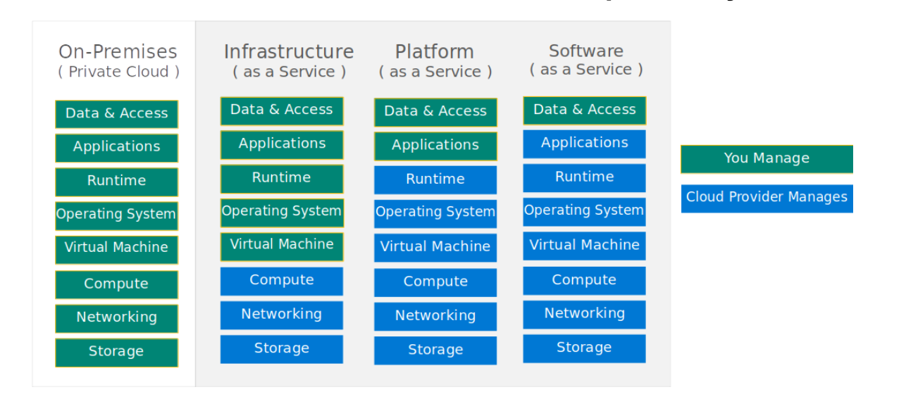

# AWS #

# Why Cloud? #

## Cloud Characteristics ##
- On-demand self-service
- Broad network access
- Resource Pooling
- Rapid elasticity
- Measured service

## Types of Cloud ##
- public
- private (on-prem infrastructure as cloud)
- hybrid (on-prem + public cloud)

## Cloud Service (Delivery) Models
- IaaS (Infrastructure as a Service)
- PaaS (Platform as a Service)
- SaaS (Software as a Service)

### Shared Resonsibility Model ###

- Computation
- Storage
    - EBS (Elastic Block Storage)
    - EFS (Elastic File System)
    - S3 (Simple Storage Service)
- Networking

## Elastic Block Storage ##
- Create a secondary volume and attach it to an instance
- Create a snapshot of the volume
- Copy the snapshot to a different region
- Create a volume from the snapshot in the other region

### Mounting a volume ###
- Create an instance
- Create a secondary volume
- Attach the secondary volume to the instance
- Mount the volume in the instance (https://docs.aws.amazon.com/AWSEC2/latest/UserGuide/ebs-using-volumes.html)
    - To list the volumes
        - > lsblk
    - To determine the filesystem in the volume
        - > sudo file -s /dev/xvdf
    - If no filesystem exists, create a filesystem in the new volume
        - > sudo mkfs -t xfs /dev/xvdf
    - Create a folder to mount the volume
        - > sudo mkdir /data
    - Mount the volume
        - > sudo mount /dev/xvdf /data
- Create a sample file in the mounted volume
- Detach the volume from the instance
- Create a new instance and attach the above create volume to the newly created instance
- Mount the volume in the new instance
- Check for the existence of the file

## IAM (Identity & Access Management) ##
- User
- Group
- Policy (JSON)
- Role (Assumed by an AWS Serviec eg EC2, S3 etc)

## S3 (Simple Storage Service) (Managed Service) ##
- Buckets (synonymous to folders)
- Objects (files)
- Versioned
- Replicated across regions
- Storage Classes (tiers)
- Host static websites
- Even though a bucket is created in a specific region, one can access it from anywhere

### AWS CLI - S3 ###
- aws s3 ls
- aws s3 ls s3://magesh-s3-website
- aws s3 cp ./index.html s3://magesh-s3-website-original
- aws s3 cp ./ s3://magesh-s3-website-original --recursive
- aws s3 sync . s3://magesh-s3-website-original
- aws s3 sync . s3://magesh-s3-website-original --delete 
- aws s3 mb s3://magesh-test-cli-bucket